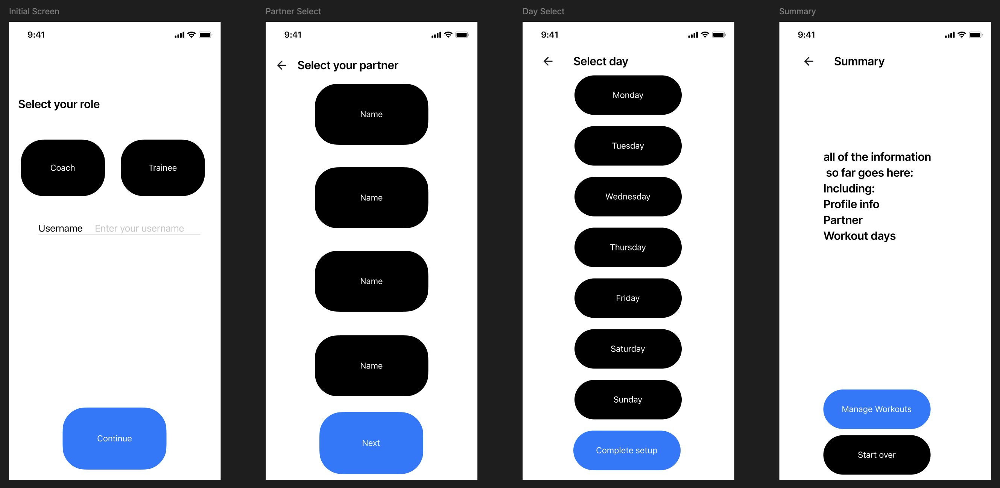

# Workout Partner App

A React Native app built with Expo Router that connects coaches with trainees for workout management and progress tracking.

## Wireframes

*Wireframes showing the complete user flow from initial setup to partner selection and scheduling.*

## Features

- **Role-based Setup**: Choose between Coach or Trainee profiles
- **Partner Matching**: Select workout partners based on your role
- **Schedule Planning**: Choose workout days of the week
- **Setup Summary**: Review and confirm your workout partnership

## Expo Packages Used

### Required Packages (4 total)

1. **expo-router** (~3.5.0)
    - **Purpose**: File-based navigation system for React Native
    - **Why Selected**: Provides clean, intuitive navigation between screens with built-in parameter passing. Modern alternative to React Navigation with better developer experience.

2. **expo-screen-orientation** (~7.0.0)
    - **Purpose**: Control device orientation
    - **Why Selected**: Locks the app to portrait mode for consistent user experience across all devices. Prevents layout issues during device rotation.

3. **@expo/vector-icons** (^14.0.0)
    - **Purpose**: Icon library with thousands of vector icons
    - **Why Selected**: Provides scalable, professional icons for UI elements like checkmarks, calendars, and user profiles. Essential for modern app design.

4. **expo-font** (~12.0.0)
    - **Purpose**: Custom font loading and management
    - **Why Selected**: Enables custom typography for brand consistency and professional appearance. Allows for better design control and accessibility.
