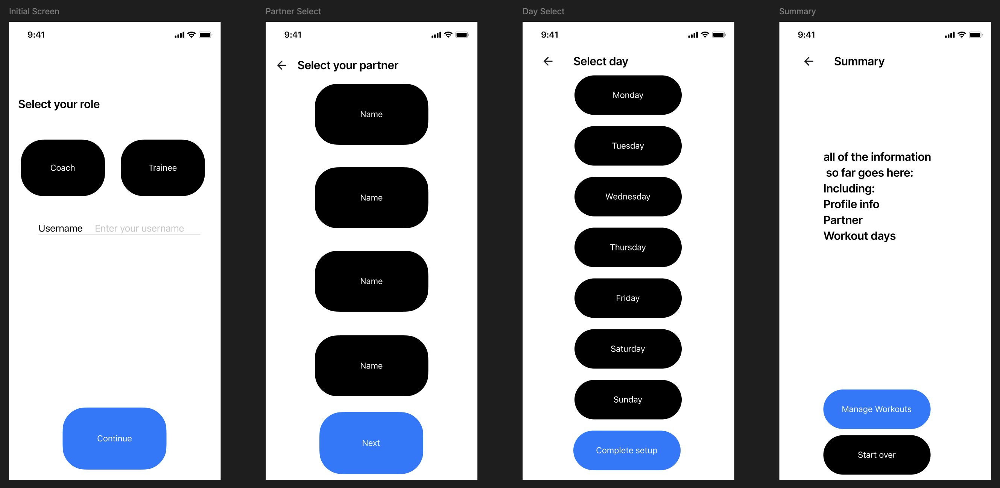

# Workout Partner App

A comprehensive React Native fitness application built with Expo Router that connects coaches with trainees for complete workout management, progress tracking, and form analysis. The app features intelligent motion detection, photo capture capabilities, and comprehensive data storage for a professional fitness experience.

## Application Description

Workout Partner is a full-featured fitness management platform designed to bridge the gap between fitness coaches and their trainees. The app provides a seamless workflow from initial user setup through comprehensive workout execution and progress tracking.

**Key Features:**
- **Role-based Setup**: Choose between Coach or Trainee profiles with customized experiences
- **Partner Matching**: Connect with workout partners based on your role and preferences
- **Intelligent Workout Builder**: Create detailed workouts with exercises, sets, reps, weights, and timing
- **Motion-Based Rep Counting**: Automatic rep detection using device accelerometer
- **Form Photo Capture**: Document exercise form and progress with integrated camera
- **Progress Tracking**: Comprehensive workout history with visual progress charts
- **Theme Management**: Dark/light mode support with persistent preferences
- **Local Data Storage**: All workout data stored securely on device with AsyncStorage

The app follows Material Design principles on Android and Human Interface Guidelines on iOS, providing a native feel across platforms while maintaining feature consistency.

## Wireframes

*Wireframes showing the complete user flow from initial setup to partner selection and scheduling.*

*Workout creation, execution, and tracking interface with camera integration*

*Progress visualization and historical data management screens*

## Material Design & Human Interface Guidelines Implementation

### Material Design Implementation (Android)

The Workout Partner app implements Material Design principles through a comprehensive design system that emphasizes usability, consistency, and visual hierarchy. The implementation follows Google's Material Design 3 guidelines with careful attention to component design, color theory, and user interaction patterns.

**Color and Typography**: The app utilizes a carefully crafted color palette with primary and secondary colors that provide excellent contrast ratios for accessibility. The blue primary color (#007AFF) conveys trust and professionalism essential for fitness applications, while the secondary colors create visual interest without overwhelming the interface. Typography follows Material Design's type scale with clear hierarchy using font weights from 400 to 700, ensuring readability across different screen sizes and contexts.

**Layout and Spacing**: The entire interface is built on Material Design's 8dp grid system, creating consistent spacing and alignment throughout the application. Cards and surfaces use appropriate elevation levels with subtle shadows that provide depth without visual clutter. The spacing system (xs: 4dp, sm: 8dp, md: 16dp, lg: 24dp, xl: 32dp, xxl: 48dp) ensures harmonious proportions across all components.

**Component Design**: Interactive elements like buttons, cards, and input fields follow Material Design specifications with appropriate touch targets (minimum 44dp), corner radius consistency, and state management. The SelectionButton component implements proper pressed states, disabled states, and accessibility features. Motion and animation follow Material Design's motion principles with meaningful transitions that guide user attention and provide feedback.

### Human Interface Guidelines Implementation (iOS)

For iOS devices, the app adapts to Human Interface Guidelines while maintaining cross-platform consistency. The navigation structure uses familiar iOS patterns with clear hierarchy and intuitive gestures. The camera integration follows iOS conventions for permission requests and user interface patterns, ensuring users feel at home with the interaction model.

**Accessibility and Usability**: Both platforms benefit from comprehensive accessibility implementation including proper semantic markup, screen reader support, and high contrast options through the theme system. Touch targets meet minimum size requirements, and interactive elements provide clear visual and haptic feedback. The motion detection feature includes sensitivity controls and manual overrides to accommodate users with different abilities and preferences.

## Technical Architecture

### Context Implementation
- **ThemeContext**: Manages dark/light mode themes with persistent storage
- **WorkoutContext**: Handles workout state management, exercise tracking, and data persistence
- **UserSessionContext**: Manages authenticated user state and preferences

### Local Data Storage
- **User Profiles**: Store user preferences, role information, and settings
- **Workout History**: Complete workout sessions with timestamps and performance data
- **Exercise Templates**: Custom exercise library with descriptions and media
- **Progress Data**: Historical tracking data for analytics and visualization

### Device Functionality Integration
- **Camera (expo-camera)**: Exercise form photos and progress documentation
- **Accelerometer (expo-sensors)**: Intelligent rep counting and movement detection
- **MediaLibrary**: Photo management and gallery integration
- **AsyncStorage**: Persistent local data storage

### Component Architecture
The app follows clean code principles with reusable, single-responsibility components:
- **Workout Components**: ExerciseCard, SetTracker, RestTimer, MotionDetector
- **UI Components**: SelectionButton, FormInput, PhotoCapture, ProgressChart
- **Layout Components**: ScreenContainer, PageHeader, themed containers
### Expo Packages Used

#### Core Navigation & UI (6 packages)
1. **expo-router** - File-based navigation system
2. **expo-screen-orientation** - Portrait mode locking
3. **@expo/vector-icons** - Comprehensive icon library
4. **expo-font** - Custom typography management
5. **expo-status-bar** - Status bar styling control
6. **@react-native-async-storage/async-storage** - Local data persistence

#### Device Functionality (4 packages)
7. **expo-camera** - Camera integration for exercise photos
8. **expo-media-library** - Photo gallery management
9. **expo-sensors** - Accelerometer for motion detection
10. **expo-constants** - Device and app information access

#### Enhanced Features (3 packages)
11. **react-native-reanimated** - Smooth animations and transitions
12. **react-native-chart-kit** - Progress visualization charts
13. **react-native-svg** - Scalable vector graphics support
